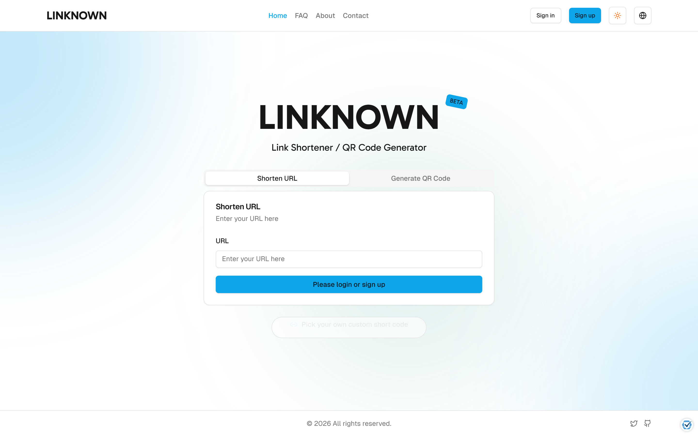
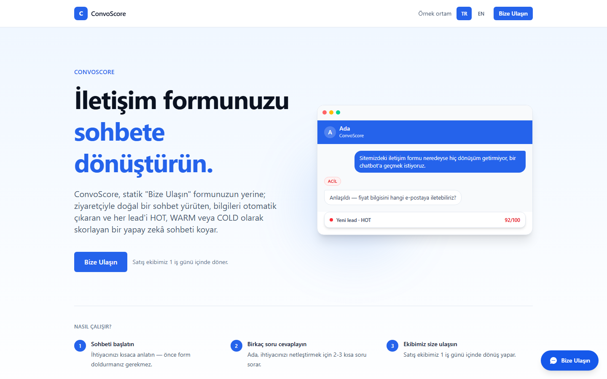
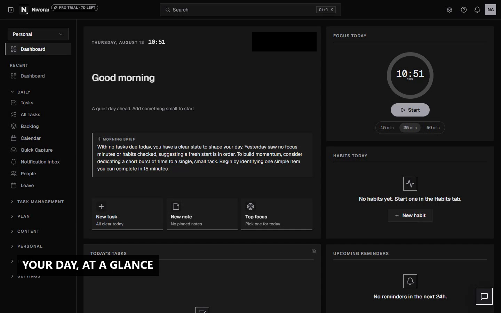
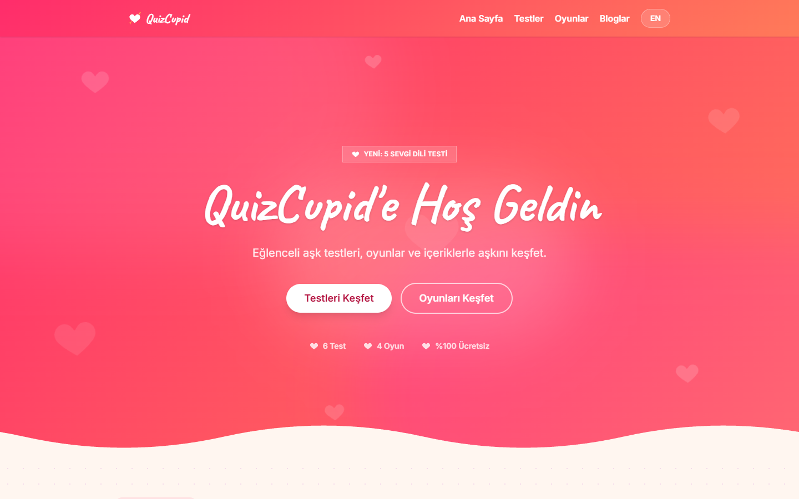

# Ilkay Bora

Full-stack developer, 3+ years shipping production code.
Built customer-facing features at Insider, a real-time voice AI agent at Algoria (Gemini Live API + Asterisk), and four independent products on the side. Strongest on the frontend, comfortable end to end.

  

 

 

## Side projects

<table>
<tr>
<td width="50%" valign="top">

<h3><a href="https://linknow-six.vercel.app">LINKNOWN</a></h3>
Link shortening and QR codes with privacy-safe click analytics: unique visitors from a one-way hash, never a stored IP, plus bot-filtered redirects and link-in-bio pages.
</td>
<td width="50%" valign="top">

<h3><a href="https://next-reach.vercel.app">ConvoScore</a></h3>
Replaces the static contact form with a chat that asks the right questions and scores the lead while the conversation is still happening.
</td>
</tr>
<tr>
<td width="50%" valign="top">

<h3><a href="https://timo-ecru.vercel.app">Nivorai</a></h3>
Self-hosted productivity suite I run for myself: Kanban, calendar, finance, fitness, mood, and habit tracking in one dashboard.
</td>
<td width="50%" valign="top">

<h3><a href="https://ask-olsun-love-app.vercel.app">QuizCupid</a></h3>
Free, bilingual (TR/EN) love tests and couple games, no signup required. Answer a few questions, get a shareable result card.
</td>
</tr>
</table>

 

 

 

Repos are private, the links above go to the live apps.

